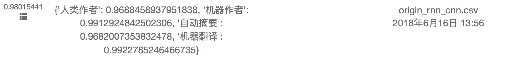

## smp2018用户画像技术评测基础方案

[用户画像技术评测](https://biendata.com/competition/smpeupt2018/)给定一个由若干媒体内容文档构成的数据集，参赛队伍采用适当的算法，对每篇文档的作者进行身份识别，区分出该文档属于人类写作、机器写作、机器翻译和机器自动摘要中的哪一类。简单的来说就是文本分类任务。

原始训练集用于模型的学习，共146,421篇，其中自动摘要31034篇，机器翻译36206，人类作者 48018，机器作者31163。每一种类型中各取5000篇作为测试集，剩下的作为训练集。

分别使用词汇级别CNN和RNN+CNN的模型进行文本分类。

## 结果
自构建的测试集上，使用RNN+CNN的模型，达到了98%的准确率。使用全部数据训练的RNN+CNN模型，在第一轮评测中的结果如图所示：

## 环境
- Python (>=3.6.1)
- TensorFlow (=1.6.0)
- jieba

## 文件结构

- data: 存储中间生成的数据
- model: 存储训练完成的模型  
- origin_data: 存储原始txt文件
- result: 存储模型预测的结果

## 代码结构
- preprocess.py: 数据预处理，处理原始json格式的文件
- init.py: 数据初始化，划分训练集测试集
- cnnmodel.py: CNN模型
- rnn_cnn_model.py: RNN+CNN模型
- test_pred.py: 计算模型预测结果的准确率

## 运行方式
	python preprocess.py#数据预处理
	python init.py#数据初始化
	python cnnmodel.py#使用CNN模型训练数据，查看结果
	python rnn_cnn_model.py#使用RNN模型训练数据，查看结果
	

